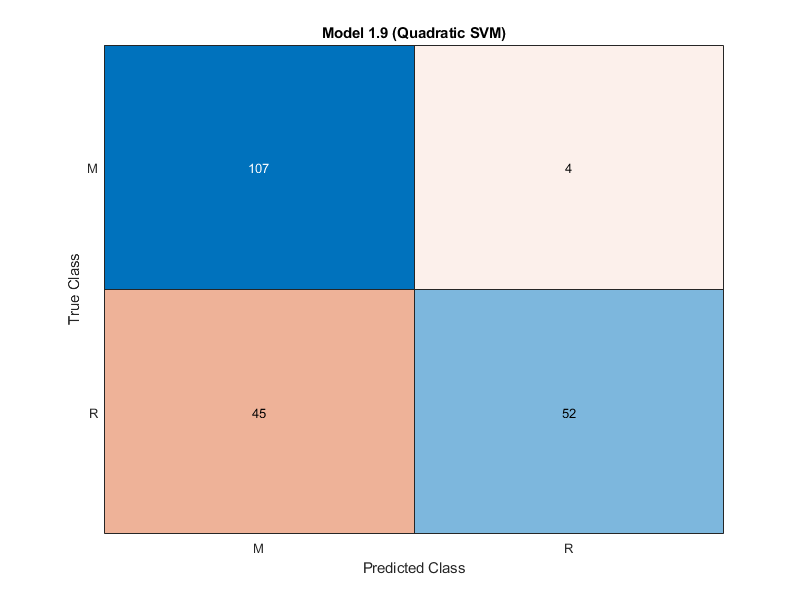

# Introduction

The task is to classify sonar signals and identify if the signal that the sonar returns represents a rock or mine (metal cylinder).
To fulfil this task we train different machine learning models on an online dataset. The dataset we are using is [Connectionist Bench (Sonar, Mines vs. Rocks) Data Set](http://archive.ics.uci.edu/ml/datasets/connectionist+bench+(sonar,+mines+vs.+rocks)).

## Description of the Dataset

The dataset consists of 208 instances. These instances are represented in CSV-Format. Each row in the CSV has 61 columns. The first 60 columns are the floating number which represent the data the sonar outputs. The last row is either a **R** or a **M** representing the class the row belongs to. **R** respectively stands for rock and **M** for mine.

# Training different algorithms

To find the right algorithm we train 24 different algorithms. Always we use cross validation with 5 folds. Cross validation splits the dataset into n-folds (partitions). Then it randomly uses the partitions as either training or validation data and running the model multiple times, taking the average of all runs as the final model. This method prevents overfitting, because by splitting into folds and alternating them between training and validation data effectively uses all data for training.

To train the algorithms we use mahlab's *classifcationLearner*.
We penalize the misclassification of mines being seen as rocks by a factor of 10. The reason for that we want to treat mines more dangerous than rocks.

For that we set misclassification cost matrix to:

|          | Mine | Rock |
| -------- | ---- | ---- |
| **Mine** | 0    | 10   |
| **Rock** | 1    | 0    |

Our trained models deliver the following results:

| Algorithm              | Accuracy | Total misclassification cost | Prediction speed |
| ---------------------- | -------- | ---------------------------- | ---------------- |
| Fine Tree              | 63.9 %   | 408                          | ~3300 obs/sec    |
| Medium Tree            | 64.4 %   | 389                          | ~5900 obs/sec    |
| Coarse Tree            | 62.5 %   | 222                          | ~8400 obs/sec    |
| Linear Discriminant    | 76.0 %   | 113                          | ~5900 obs/sec    |
| Quadratic Discriminant | 73.6 %   | 118                          | ~6300 obs/sec    |
| Gaussian Naïve Bayes   | 72.1 %   | 373                          | ~3800 obs/sec    |
| Kernel Naïve Bayes     | 76.0 %   | 167                          | ~520 obs/sec     |
| Linear SVM             | 54.8 %   | 94                           | ~5900 obs/sec    |
| Quadratic SVM          | 76.4 %   | 85                           | ~8300 obs/sec    |
| Cubic SVM              | 86.1 %   | 92                           | ~7800 obs/sec    |
| Fine Gaussian SVM      | 53.4 %   | 97                           | ~7600 obs/sec    |
| Medium Gaussian SVM    | 53.8 %   | 96                           | ~8500 obs/sec    |
| Coarse Gaussian SVM    | 53.4 %   | 97                           | ~8000 obs/sec    |
| Fine KNN               | 85.1 %   | 112                          | ~4600 obs/sec    |
| Medium KNN             | 60.6 %   | 82                           | ~6400 obs/sec    |
| Coarse KNN             | 53.4 %   | 97                           | ~5600 obs/sec    |
| Cosine KNN             | 64.4 %   | 74                           | ~4800 obs/sec    |
| Cubic KNN              | 59.6 %   | 84                           | ~2900 obs/sec    |
| Weighted KNN           | 64.9 %   | 73                           | ~5400 obs/sec    |
| Boosted Trees          | 65.9 %   | 404                          | ~2900 obs/sec    |
| Bagged Trees           | 66.3 %   | 88                           | ~850 obs/sec     |
| Subspace Discriminant  | 67.8 %   | 112                          | ~720 obs/sec     |
| Subspace KNN           | 82.7 %   | 162                          | ~490 obs/sec     |
| RUSBoosted Trees       | 75.0 %   | 313                          | ~2000 obs/sec    |

As our final model we choose the **Quadratic SVM**. Even though it has a lower Accuracy than the Cubic SVM the Total Misclassification cost is lower, which is in our use case more important. Also it runs slightly faster in inference mode which is beneficial for running the model on low powered devices.

